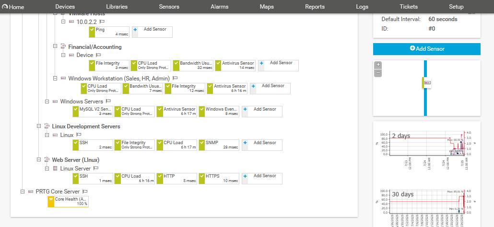

# Cybersecurity-Monitoring-Strategy-Using-PRTG

##  Project Overview

This project simulates the development and implementation of a proactive cybersecurity monitoring strategy for a fictional organization, **Big Dog Enterprise**. The core objective is to secure business-critical assets by aligning monitoring tools with organizational risk levels and established industry frameworks like **NIST CSF**, **MITRE ATT&CK**, and **CIS Controls**.

## Executive Summary

Big Dog Enterprise operates a hybrid infrastructure, including Windows servers, Linux development machines, and Windows workstations. To reduce the risk of security breaches, the project leverages **PRTG Network Monitor** for real-time threat detection, response automation, and actionable insights into system vulnerabilities. All efforts focus on protecting data confidentiality, system integrity, and service availability.

## Objectives

- Prioritize security sensors based on the importance of the assets they monitor, threat landscape, and risk severity.
- Establish alert thresholds for timely incident detection and response.
- Recommend monitoring strategies tied to organizational priorities and compliance requirements.

##  Methodology

The project followed a structured four-phase methodology, aligned with NIST RMF stages:

1. **Prepare (Asset Identification)**  
   Assets were categorized under five Security Impact Levels (SILs) – Privacy, Proprietary, Administrative, Financial, and Security Management.

2. **Identify (Risk and Threat Analysis)**  
   Used the MITRE ATT&CK framework to identify techniques and tactics targeting critical systems.

3. **Detect (Sensor Deployment & Threshold Configuration)**  
   Configured and deployed PRTG sensors across key endpoints, databases, and network devices.

4. **Respond (Incident Handling Protocols)**  
   Mapped custom alert thresholds and escalation playbooks to support rapid mitigation.

##  Table of Sensors

| Sensor                  | Purpose                                    | IoCs Detected                      | Threshold                    | Mapped to NIST CSF     | MITRE ID   |
|------------------------|--------------------------------------------|------------------------------------|-----------------------------|-------------------------|------------|
| CPU Load Sensor        | Detect resource exhaustion or malware      | High CPU usage                     | >85% sustained              | DE.CM                   | T1055      |
| Bandwidth Usage Sensor | Monitor data exfiltration or DDoS          | Traffic spikes                     | >150% of baseline           | DE.AE                   | —          |
| MySQL Query Sensor     | SQL Injection Detection                    | Slow/abnormal queries              | >2s query time              | DE.CM                   | T1190      |
| HTTP Load Time Sensor  | Detect DoS attacks on web servers          | Latency issues                     | >5s consistent load times   | DE.AE                   | T1499      |
| File Integrity Sensor  | Monitor for tampering or persistence       | Unauthorized file changes          | Any unauthorized change     | DE.CM                   | T1027      |
| SSH Login Sensor       | Track brute-force attempts                 | Failed login attempts              | >5 failed logins in 10 min  | DE.CM                   | T1110      |
| Antivirus Status       | Ensure malware defenses are operational    | Disabled/outdated AV               | Inactive or 7+ days outdated| PR.IP                   | T1089      |
| Windows Event Logs     | Detect privilege escalation or anomalies   | New admin account creation         | Critical log changes        | DE.CM                   | T1078      |

##  Security Impact Levels (SILs)

1. **Privacy** – Protects customer/employee data on Windows workstations.  
2. **Proprietary** – Safeguards intellectual property on Linux dev environments.  
3. **Administrative** – Ensures SQL server/database reliability and monitoring.  
4. **Financial** – Secures accounting applications and transaction records.  
5. **Security Management** – Monitors PRTG and centralized logging systems.

##  Outcomes

- Identified vulnerable endpoints and traffic patterns.
- Simulated real-world attack scenarios using MITRE tactics.
- Aligned sensor deployments to organization’s critical asset map.
- Created a formal monitoring policy and incident response protocol.

##  Skills Gained

- Conducted risk analysis based on NIST CSF and RMF.
- Designed and deployed PRTG sensors for network security.
- Mapped threats to MITRE ATT&CK and prioritized IoCs.
- Configured alert thresholds based on industry benchmarks.
- Created executive-ready reporting and dashboard visualization.

###  Executive Briefing Presentation
>  [View Presentation Summary](https://www.loom.com/share/1a444a32168b45f0b4c594d37f65153c)

---

## 📁 Project File
[Cybersecurity Monitoring Strategy Using PRTG, A Risk and Vulnerability Report (pdf)](Docs/Cybersecurity_Monitoring_Strategy_Using_PRTG_A_Risk_And_Vulnerability_Report.pdf)

---

## Screenshot 

|  | 
- *This dashboard provides a visual representation of the sensor deployment strategy across Big Dog’s network*

---

##  References

- [NIST Cybersecurity Framework](https://www.nist.gov/cyberframework)  
- [MITRE ATT&CK Framework](https://attack.mitre.org)  
- [CIS Critical Security Controls](https://www.cisecurity.org/controls/)  
- [Paessler PRTG Official Documentation](https://www.paessler.com)  
- [Red Gate SQL Security Guide](https://www.red-gate.com)  
- [Microsoft Server & Event Log Security](https://learn.microsoft.com)  

## 👤 Author
**Ifeanyi Christian Edeh**  
Cybersecurity Specialist  
[LinkedIn Profile](https://www.linkedin.com/in/ifeanyiedeh)
